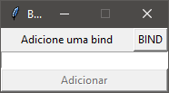
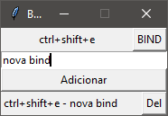

# Bind Tool - Python (Tkinter)

### Descrição

Projeto de uma ferramenta para a criação de binds de texto, utilizando tkinter para a interface gráfica.

### Instalação 

Iniciar 
```bash
py main.pyw
```

Bibliotecas (Python 3.10 - Windows)
- tkinter 

### Demonstração

<details>
<summary>Funcionamento</summary>




</details>
