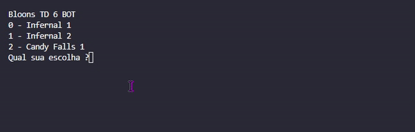

# Bloons TD 6 BOT - Python

### Descrição

Projeto simples com deteção de imagens e automação de ações, desenvolvido para funcionar de forma autónoma, consistindo em um bot para jogo bloons td 6.

### Instalação

```bash
pip install -r requirements.txt
```

Iniciar
```bash
./start.bat
```

Bibliotecas (Python3.10 - Windows)
- pyautogui
- pygetwindow
- pywin32
- opencv-python
- keyboard

### Demonstração

Funcionamento
<div style="width:100%;height:0px;position:relative;padding-bottom:75.000%;"><iframe src="https://streamable.com/e/4n24rr?autoplay=1" frameborder="0" width="100%" height="100%" allowfullscreen allow="autoplay" style="width:100%;height:100%;position:absolute;left:0px;top:0px;overflow:hidden;"></iframe></div>

Console

