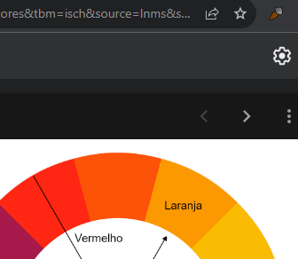

# Color Picker Extensão - JavaScript

### Descrição

Projeto feito com JavaScript puro (Vanilla JS). Extensão para coletar cores de uma pagina web e de armazenar as últimas cores utilizadas.

### Instalação

Abra a aba de extensões do navegador e habilite a opção de "desenvolvedor", depois basta acessar a opção "carregar expandida" e inserir a pasta do projeto.

### Demonstração

Previews

Foto Da Extensão

Video Da Extensão

