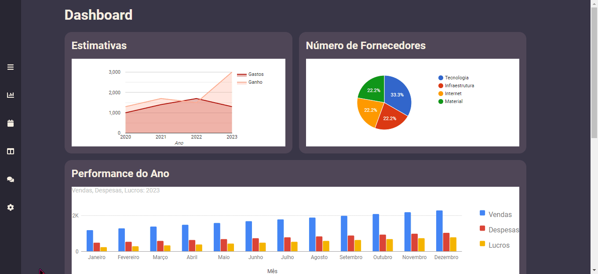
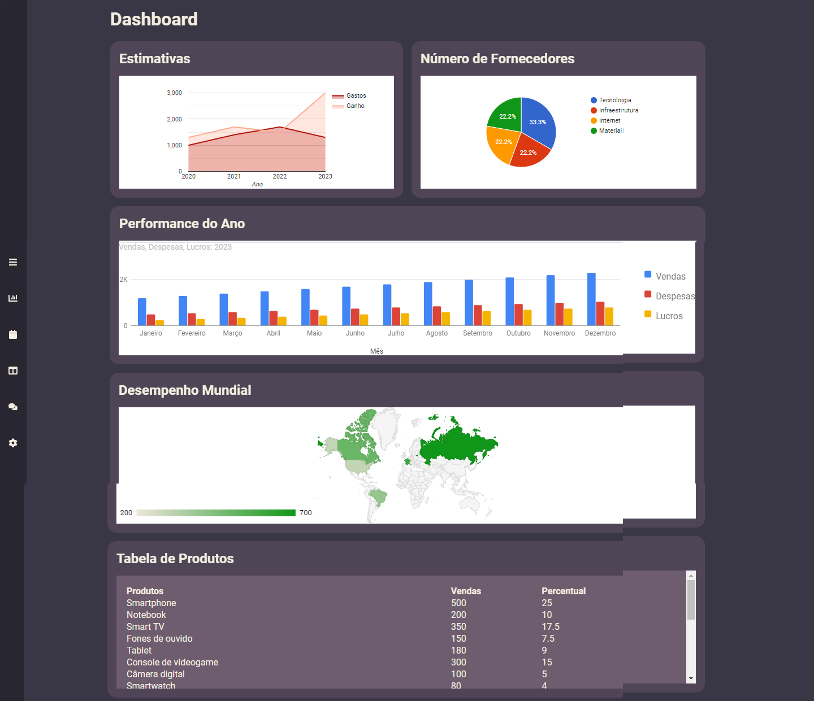

# Dashboard Website - React 

### Descrição

Projeto com intuito de colocar em pratica a utilização de componentes e a criação de um site fictício para uma empresa de negócios, além de por em pratica a utilização do react. 

- One Page

### Instalação

Comando De Instalação
```bash
npm install
```

Execução
```shell
npm start
```

Bibliotecas
- react-icons
- react-google-charts

### Demonstração

Projeto on-line! [[Demo]](https://dashboard-website-react.vercel.app/)

Previews
<details>
<summary>Video</summary>



</details>
<details>
<summary>Laptop 1440x900</summary>



</details>

<details>
<summary>iPad 768x1024</summary>


</details>

<details>
<summary>Pixel-3 XL 393x786</summary>


</details>
