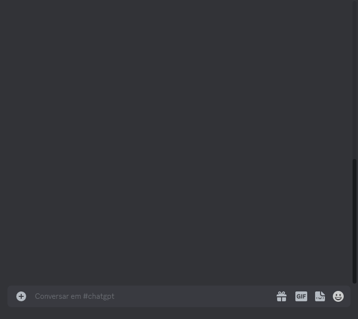

# Discord Bot Chat IA

### Descrição

Projeto criado com o intuito de viabilizar a utilização da api da openIA em servidores do discord, tendo a integração do chat bot e geração de imagens através do input do usuário.

### Instalação

Comando De Instalação
```bash
pip install -r requirements.txt
```

Desenvolvido (Caso haja erro)
```bash
pip install discord.py==2.2.3
pip install openai==0.27.7
```

Configuração

- Adicione o token do discord bot no arquivo main.py no código `bot.run('TOKEN')`

### Comandos

```
.ajuda
mostra todos os comandos.

.chat <arg>
converse com a IA.

.chat (reset)
limpa o contexto da conversa (interações antigas).

.navegar <arg>
faz uma pesquisa utilizando seu prompt.

.imagem <arg>
gera uma imagem utilizando seu prompt.

.perfil
veja o seu perfil.

.api <arg>
cadastra api no bot.
```

### Demonstração


