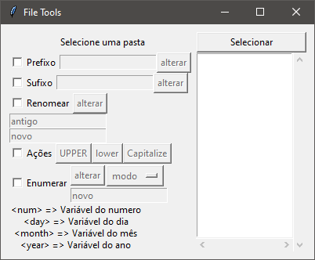

# File Tools - Python (Tkinter)

### Descrição

Projeto com interface gráfica feito em Python, com principal objetivo de adicionar algumas funcionalidades como alteração do nome de arquivos de forma massiva e de diversas formas, facilitando a renomeação.

### Instalação 

Iniciar 
```bash
py main.pyw
```

Bibliotecas (Python 3.10 - Windows)
- tkinter 

### Demonstração

<details>
<summary>Funcionamento</summary>



</details>

