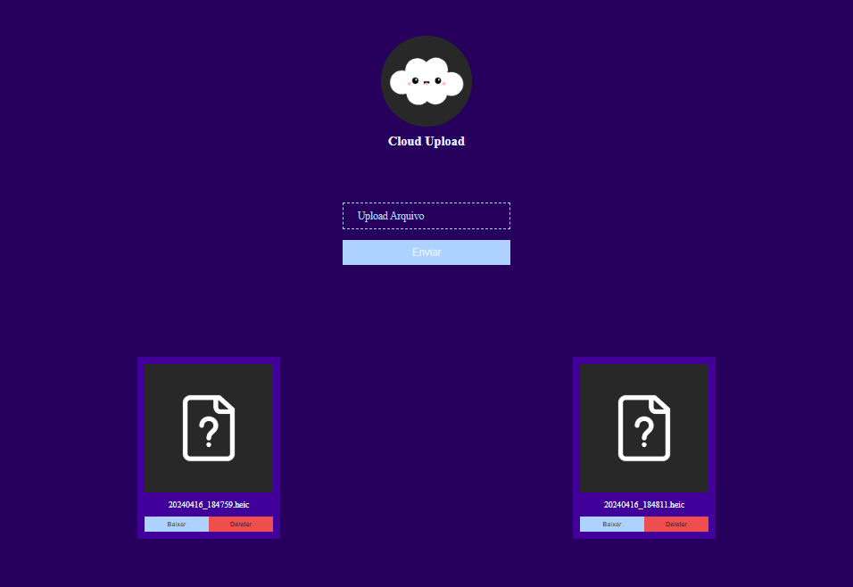

# File Uploader Website - Flask

### Descrição

Projeto simples, inteiramente feito com python flask com intuito de transferir arquivos localmente com facilidade.

### Instalação 

```bash
pip install flask
```

Iniciar Site

```bash
py main.py
```

Endereço
```url
localhost:5000
```

Bibliotecas (Python 3.10 - Windows)
- flask 

### Demonstração

Visualizar [[demo]]()

<details>
<summary>Imagens</summary>



</details>

