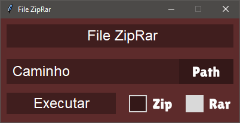
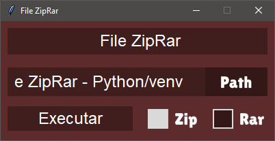

# File ZipRar

### Descrição

Projeto utilizando a interface gráfica do tkinter com design feito no Figma de uma aplicação para descompactar e compactar arquivos RAR e ZIP.

### Instalação

Comando De Instalação
```bash
pip install -r requirements.txt
```

Iniciar
```
py main.pyw
```

### Demonstração

<details>
<summary>Imagens</summary>




</details>
