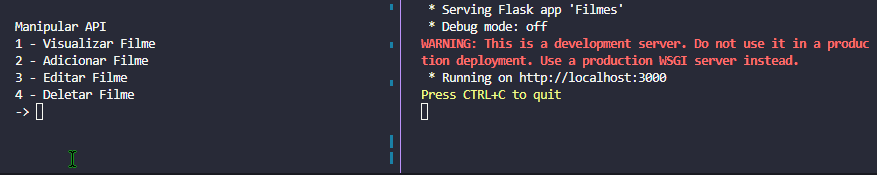

# API de Filme Simples (Flask)

### Descrição

Projeto simples feito em Python, pondo em prática a utilização do framework Flask para a confecção de uma API que consiga acessar, adicionar, editar e deletar informações, além de um script simples para a manipulação da API.

### Instalação 

```bash
pip install -r requirements.txt
```

Iniciar API (Execute Primeiro)

```bash
py api.py
```

Iniciar Script Para Manipulação 
```bash
py main.py
```

Bibliotecas (Python 3.10 - Windows)
- flask 
- requests

### Demonstração

<details>
<summary>Funcionamento</summary>

Manipulador/Api


</details>

