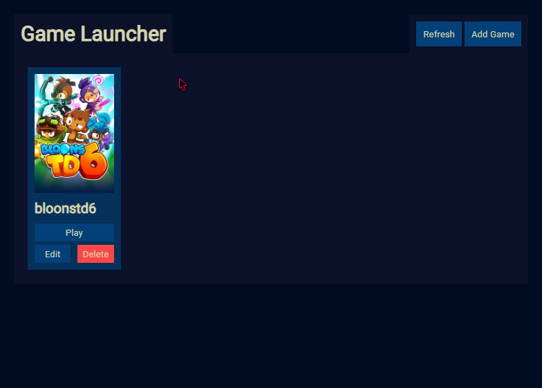
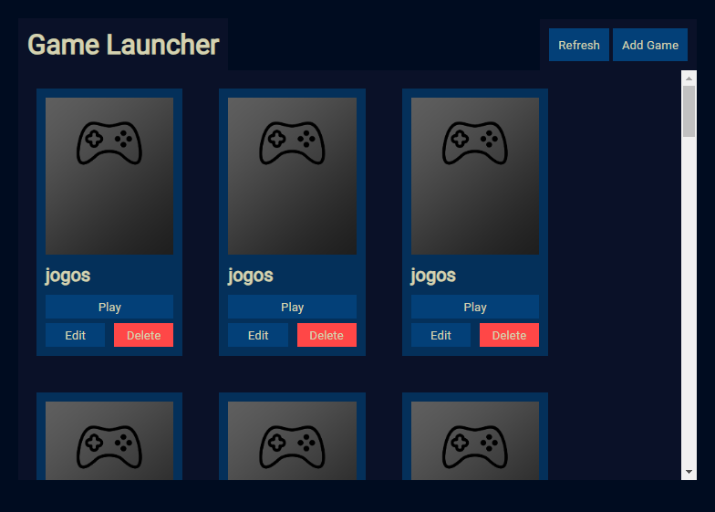

# GameLauncher - JavaScript (Electron) 

### Descrição

Projeto feito com a linguagem de programação javascript, utilizando electron para produzir a aplicação desktop, simulando um launcher de jogos com as funcionalidades CRUD.

### Instalação 

```bash
npm install 
```

Iniciar 
```bash
npm run dev
```

Bibliotecas (Node 16.6.0 - Windows)
- electron

### Demonstração

<details>
<summary>Aplicação (Imagem)</summary>





</details>

<details>
<summary>Aplicação (Video)</summary>

https://streamable.com/e/oe34fs?quality=highest

</details>
