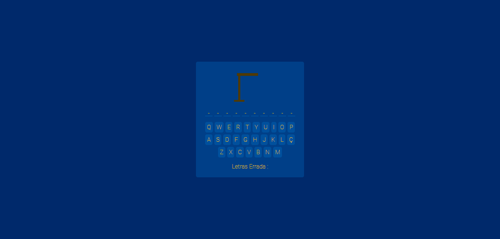
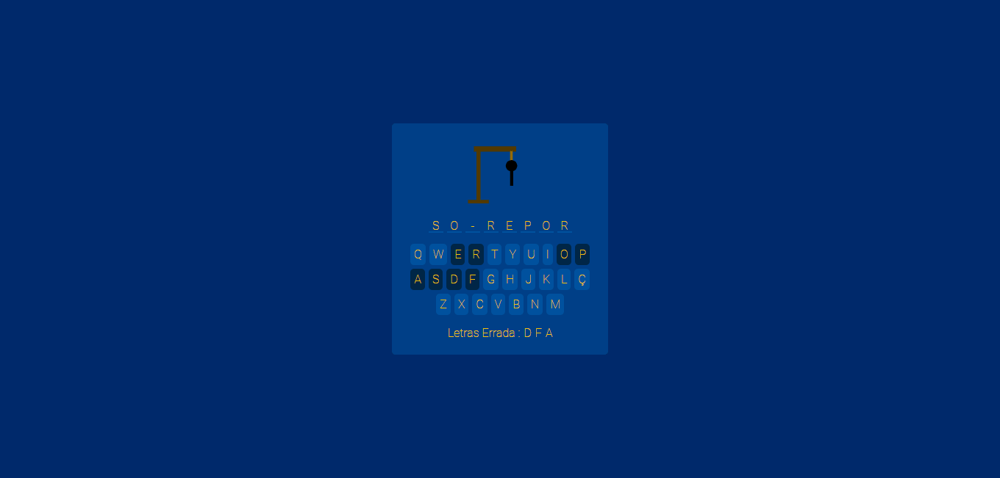

# Jogo Da Forca - React 

### Descrição

Projeto de um jogo da forca utilizando React, com a manipulação de arrays e a presença de styled components para separar os estilos.

### Instalação

Comando De Instalação 
```bash
npm install
```

Execução 
```shell
npm start
```

Bibliotecas (Site)
- react-icons
- styled-components

### Demonstração

Projeto on-line! [[Demo]]()

Previews
<details>
<summary>Demonstração</summary>




</details>
