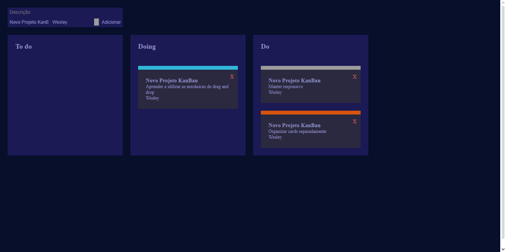

# KanBan Website

### Descrição

Projeto simples com java-script puro, com a finalidade de aprendizagem e aperfeiçoamento com a utilização dos eventos handle (drag and drop) para manipular objetos na página.  

### Demonstração

Visualizar [[demo]]()

Imagens

