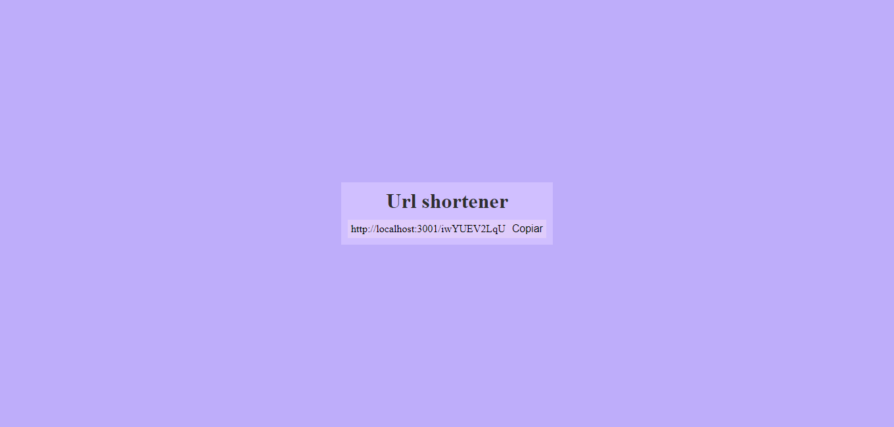

# Link Shortener (Flask)

### Descrição

Projeto de um encurtador de links utilizando flask, contendo o armazenamento dos dados através de um arquivo json.

### Instalação 

```bash
pip install -r requirements.txt
```

Iniciar Site

```bash
py main.py
```

Endereço
```url
localhost:3001
```


Bibliotecas (Python 3.10 - Windows)
- flask 

### Demonstração

Visualizar [[demo]](https://replit.com/@WesleyMacedo1/Link-Shortener-Python-Flask)

<details>
<summary>Funcionamento</summary>




</details>

