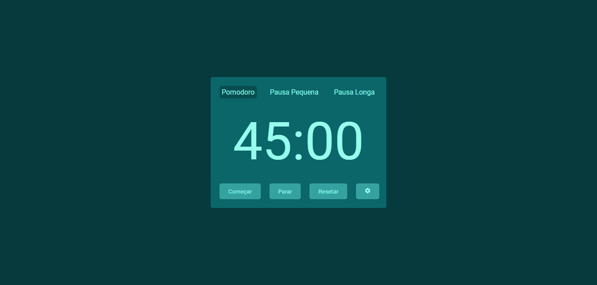
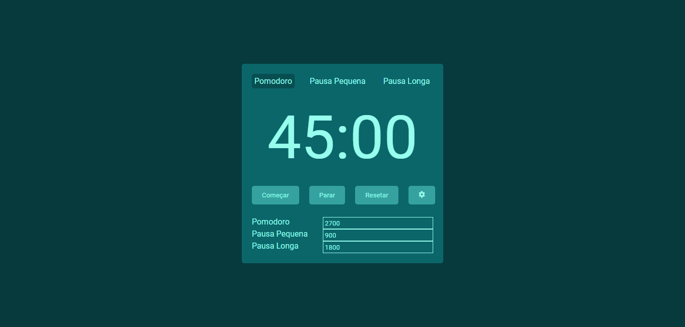

# Pomodoro - React 

### Descrição

Projeto de um site com a técnica pomodoro utilizando react, composto com os três contadores (pomodoro, pausa curta e pausa longa), além de conter um menu de configurações para alterar o tempo dos cronómetros.

### Instalação

Comando De Instalação
```bash
npm install
```

Execução
```shell
npm start
```

Bibliotecas
- react-icons
- styled-components

### Demonstração

Projeto on-line! [[Demo]](http://pomodoro-react--wesleymacedo1.repl.co/)

Previews
<details>
<summary>Site</summary>




</details>
