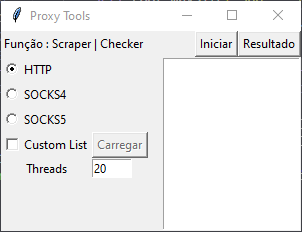
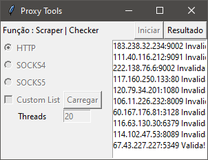

# Proxy Tools - Python (Tkinter)

### Descrição

Projeto de uma aplicação verificadora e scraper de proxys (http, socks4, socks5), utilizando interface gráfica (tkinter), requisições (requests) e paralelismo (threading).

### Instalação 

Instalação
```bash
pip install -r requirements.txt
```

Iniciar 
```bash
py main.pyw
```

Bibliotecas (Python 3.10 - Windows)
- tkinter 
- requests
- requests[socks]

### Demonstração

<details>
<summary>Funcionamento</summary>




</details>

