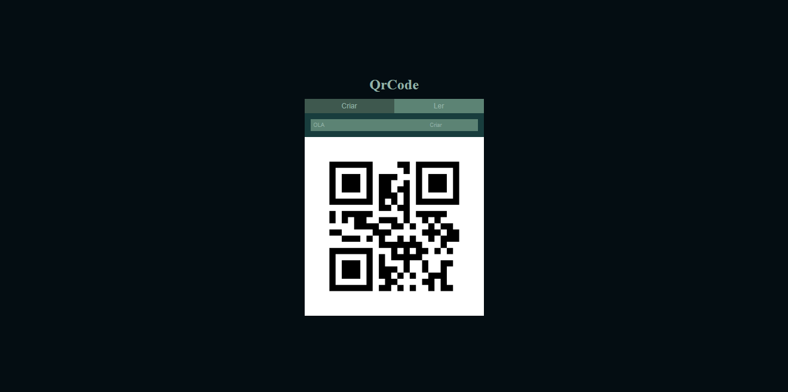

# Qr Code API - Python (Flask)

### Descrição

Projeto com a utilização de uma página estática com java-script puro, para a geração e leitura de qrcodes, utilizando uma api interna com python flask e pyqrcode/pyzbar para a criação e leitura.

### Instalação 

```bash
pip install -r requirements.txt
```

Iniciar Site

```bash
py main.py
```

Endereço API /qrcode (GET/POST)
```url
localhost:5000
```

Bibliotecas (Python 3.10 - Windows)
- pyqrcode
- flask
- flask_cors
- pyzbar
- opencv-python

### Demonstração

Visualizar [[demo]]()

<details>
<summary>Imagens</summary>



</details>


