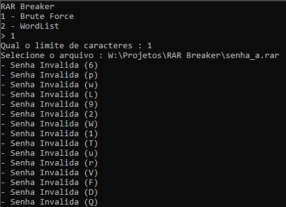

# RAR Breaker - Python

### Descrição

Projeto CLI com python, sem a utilização de bibliotecas externas, com objetivo de quebrar senhas de arquivos rar através do método brute-force.

### Demonstração

Visualizar [[demo]]()

Imagens

