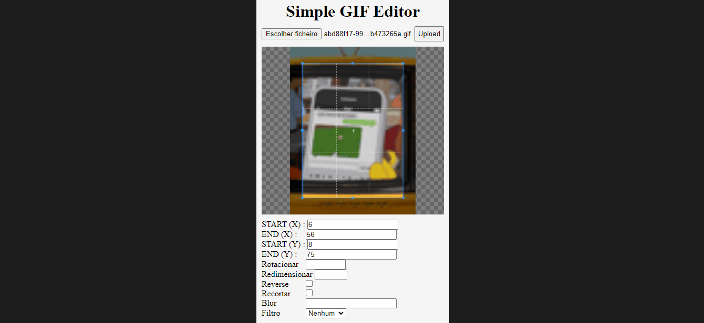
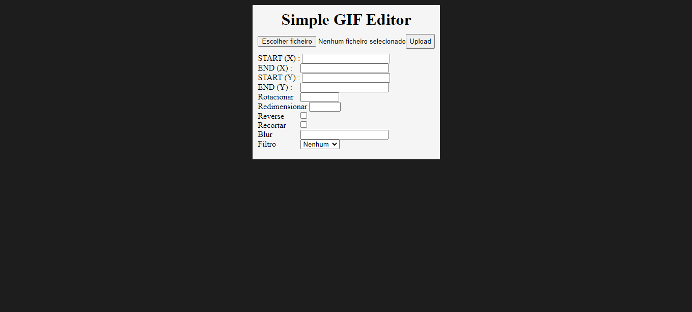

# Simple Gif Editor (Flask)

### Descrição

Projeto de um simples editor de gif feito com Flask e Pillow.

### Instalação 

```bash
pip install -r requirements.txt
```

Iniciar Site

```bash
py main.py
```

Endereço
```url
localhost:5000
```

Bibliotecas (Python 3.10 - Windows)
- flask 
- pillow

### Demonstração

Visualizar [[demo]]()

<details>
<summary>Imagens</summary>




</details>
