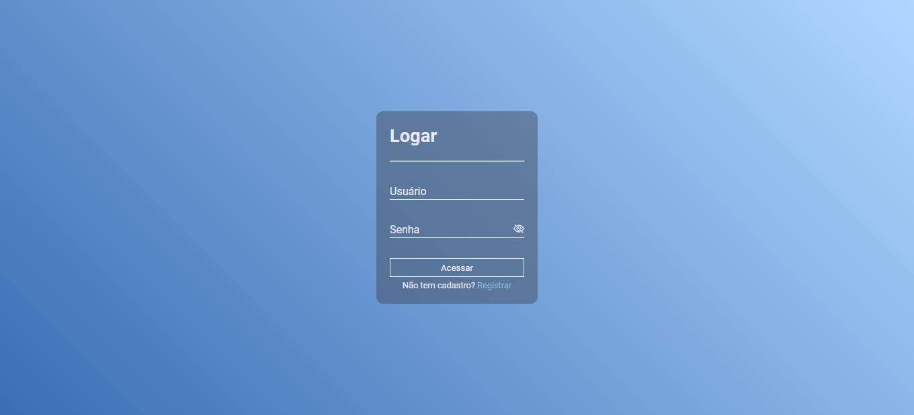
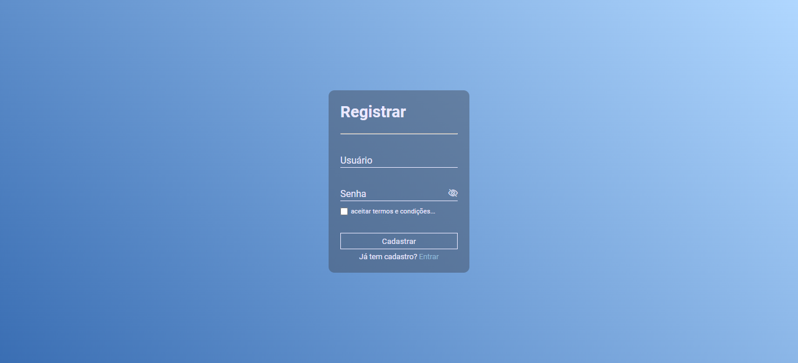
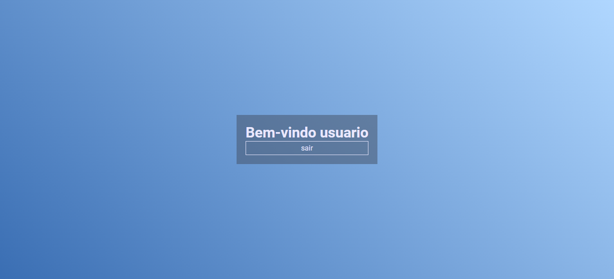

# Tela De Cadastro\Login - JavaScript

### Descrição

Projeto feito com JavaScript puro (Vanilla JS). Tela interativa de cadastro e login, com sistema de validação e verificação, utilizando o localStorage para armazenar e gerenciar os dados obtidos.

### Demonstração

[[Demo]]()

Previews

Tela de Login

Tela de Cadastro

Tela Home

