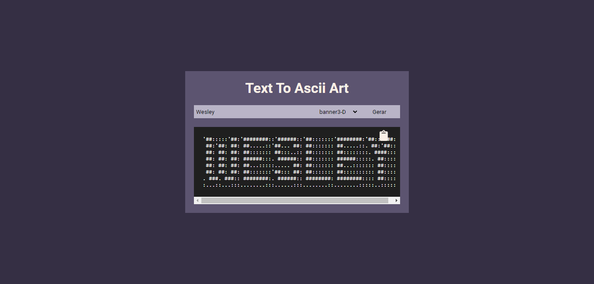
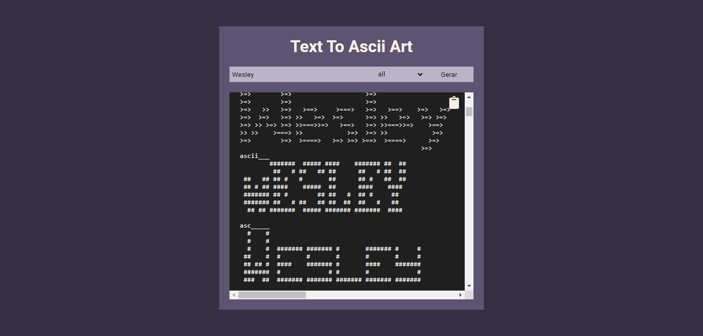

# Text To Ascii - React 

### Descrição

Projeto de uma página geradora de arte ASCII, utilizando React para a construção do site e Python para a API responsável pela geração e disponibilização das artes em ASCII.

### Instalação

Comando De Instalação (Site)
```bash
npm install
```

Execução (Site)
```shell
npm start
```
-> localhost:3000

Bibliotecas (Site)
- react-icons
- styled-components

Comando De Instalação (Api)
```bash
cd .\Api\
pip install -r requirements.txt
```

Execução (Api)
```shell
cd .\Api\
py main.py
```

-> localhost:3333

Bibliotecas (Api)
- flask
- flask_cors
- pyfiglet

### Demonstração

Projeto on-line! [[Demo]]()

Previews
<details>
<summary>Demonstração</summary>




</details>
