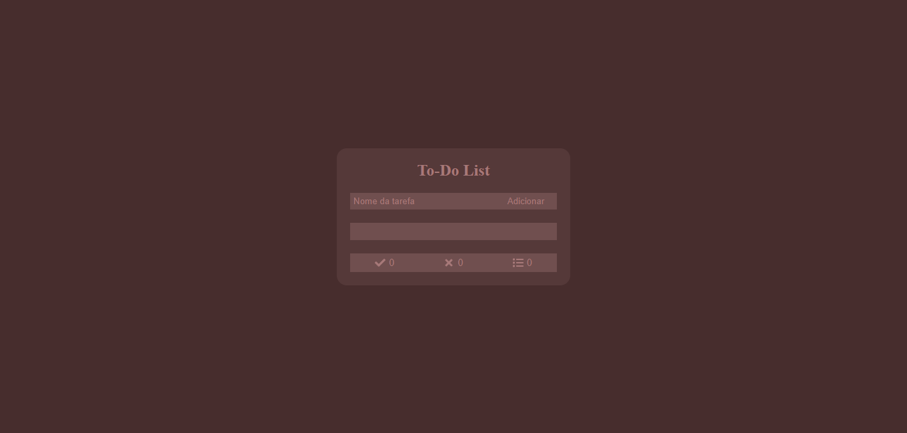
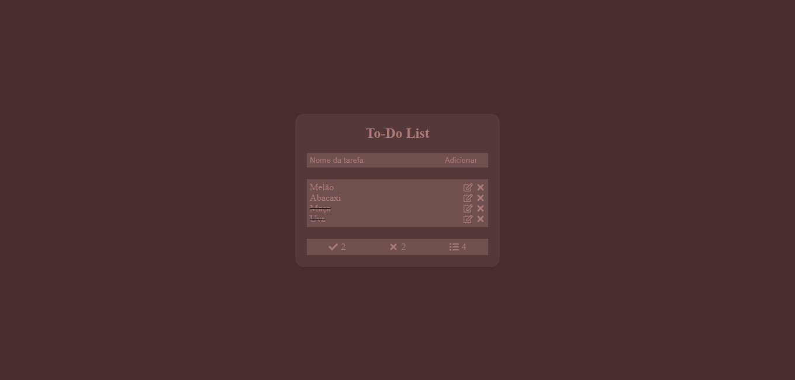
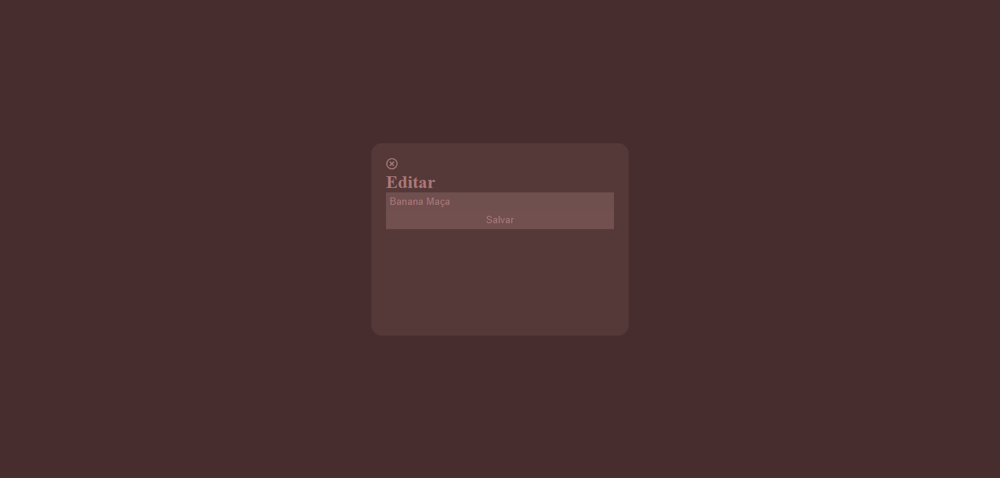

# To-Do List - React 

### Descrição

Projeto de uma to-do list utilizando react, com as funcionalidades de adição de tarefas, remoção, alteração e mudança de estado para sinalizar como tarefa concluída.

### Instalação

Comando De Instalação
```bash
npm install
```

Execução
```shell
npm start
```

Bibliotecas
- react-icons
- styled-components

### Demonstração

Projeto on-line! [[Demo]]()

Previews
<details>
<summary>Site</summary>





</details>
