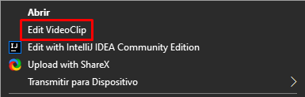
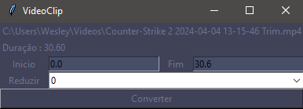

# Video Clips - Python (FFMPEG)

### Descrição

Projeto feito para facilitar o recorte de partes de vídeos de forma rápida e prática, além de reduzir a qualidade através da proporção.

### Instalação 

```bash
pip install -r requirements.txt
```

Iniciar Script

```bash
py main.py
```

Programas externos (necessita)
- FFMPEG

Bibliotecas (Python 3.10 - Windows)
- opencv-python

### Demonstração

Visualizar [[demo]]()

<details>
<summary>Imagens</summary>




</details>


