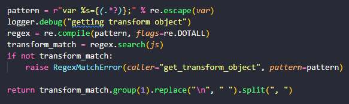
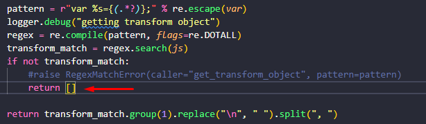

# Youtube Downloader - Python

### Descrição

Projeto simples feito em python para o download de videos/musicas do youtube.

### Instalação 

Recomendado a utilização do (venv)

```bash
pip install -r requirements.txt
```

Iniciar

```bash
py main.py
```

Bibliotecas (Python 3.10 - Windows)
- pytube (15.0.0 - Existem bugs)

### Demonstração

<details>
<summary>Funcionamento</summary>

Baixando videos/musicas


Baixando playlist


</details>

<details>
<summary>Resolver Bug</summary>

Erro no arquivo "packages/pytube/cipher.py" na função "get_transform_object"


Solução (substituir o valor de retorno)


</details>
